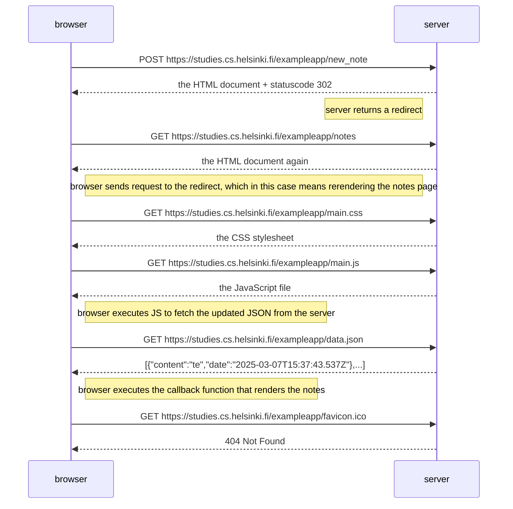

```mermaid
sequenceDiagram

participant browser
participant server

browser->>server: POST https://studies.cs.helsinki.fi/exampleapp/new_note
server-->>browser: the HTML document + statuscode 302

note left of server: server returns a redirect

browser->>server: GET https://studies.cs.helsinki.fi/exampleapp/notes
server-->>browser: the HTML document again

note right of browser: browser sends request to the redirect, which in this case means rerendering the notes page

browser->>server: GET https://studies.cs.helsinki.fi/exampleapp/main.css
server-->>browser: the CSS stylesheet

browser->>server: GET https://studies.cs.helsinki.fi/exampleapp/main.js
server-->>browser: the JavaScript file

note right of browser: browser executes JS to fetch the updated JSON from the server

browser->>server: GET https://studies.cs.helsinki.fi/exampleapp/data.json
server-->>browser: [{"content":"te","date":"2025-03-07T15:37:43.537Z"},...]

note right of browser: browser executes the callback function that renders the notes

browser->>server: GET https://studies.cs.helsinki.fi/exampleapp/favicon.ico
server-->>browser: 404 Not Found

```

