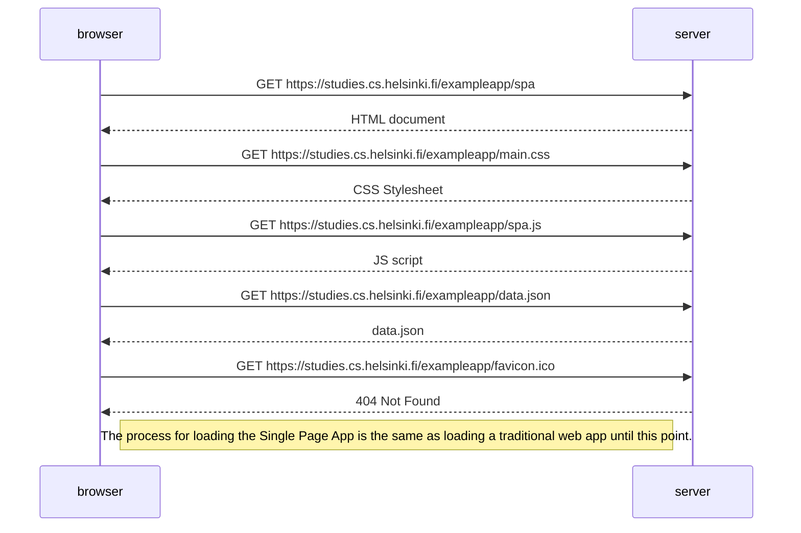

```mermaid
sequenceDiagram

participant browser
participant server

browser->>server: GET https://studies.cs.helsinki.fi/exampleapp/spa
server-->>browser: HTML document


browser->>server: GET https://studies.cs.helsinki.fi/exampleapp/main.css
server-->>browser: CSS Stylesheet

browser->>server: GET https://studies.cs.helsinki.fi/exampleapp/spa.js
server-->>browser: JS script

browser->>server: GET https://studies.cs.helsinki.fi/exampleapp/data.json
server-->>browser: data.json

browser->>server: GET https://studies.cs.helsinki.fi/exampleapp/favicon.ico
server-->>browser: 404 Not Found

Note right of browser: The process for loading the Single Page App is the same as loading a traditional web app until this point.

```
