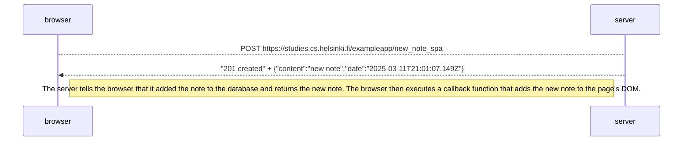

```mermaid
sequenceDiagram

participant browser
participant server

browser-->server: POST https://studies.cs.helsinki.fi/exampleapp/new_note_spa
server-->>browser: "201 created" + {"content":"new note","date":"2025-03-11T21:01:07.149Z"}

note right of browser: The server tells the browser that it added the note to the database and returns the new note. The browser then executes a callback function that adds the new note to the page's DOM.

```